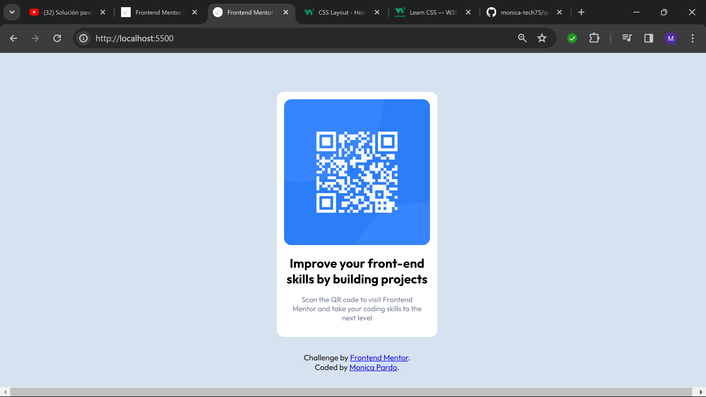
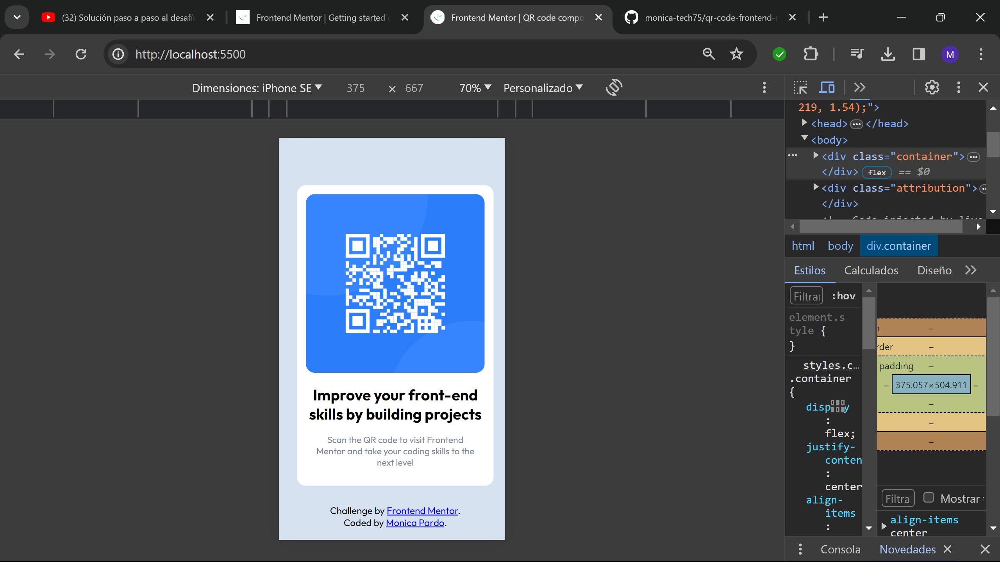

# Frontend Mentor - QR code component solution

This is a solution to the [QR code component challenge on Frontend Mentor](https://www.frontendmentor.io/challenges/qr-code-component-iux_sIO_H). Frontend Mentor challenges help you improve your coding skills by building realistic projects. 

## Table of contents

- [Overview](#overview)
  - [Screenshot](#screenshot)
  - [Links](#links)
  - [Built with](#built-with)
  - [What I learned](#what-i-learned)
  - [Continued development](#continued-development)
  - [Useful resources](#useful-resources)
- [Author](#author)
- [Acknowledgments](#acknowledgments)

**Note: Delete this note and update the table of contents based on what sections you keep.**

## Overview

### Screenshot
Screenshot for desktop

Screenshot for mobile device



### Links

- Solution URL: (https://github.com/monica-tech75/qr-code-frontend-mentor)

- Live Site URL: (https://monica-tech75.github.io/qr-code-frontend-mentor/)


### Built with

- Semantic HTML5 markup
- CSS custom properties
- Flexbox
- Mobile-first workflow

### What I learned

I learned how to add images and how to adjust to different screen
I also learn how to make my own favicon

```html
<link rel="icon" type="image/png" sizes="32x32" href="./images/my_faviconM.png">
```
```css
.main-card {
  max-width: 330px;
}
.main-card img {
  width: 100%;
}
```
### Continued development
I need to learn more about flexbox and how to center vertically and horizontaly.

## Author
This is one site i have on github pages, is not finish, I'm still working on it.
- Website - [Monica Pardo](https://monica-tech75.github.io/portafolio2/)

- Frontend Mentor - [@monica-tech75](https://www.frontendmentor.io/profile/monica-tech75)


## Acknowledgments

Thanks to frontendmentor community.


